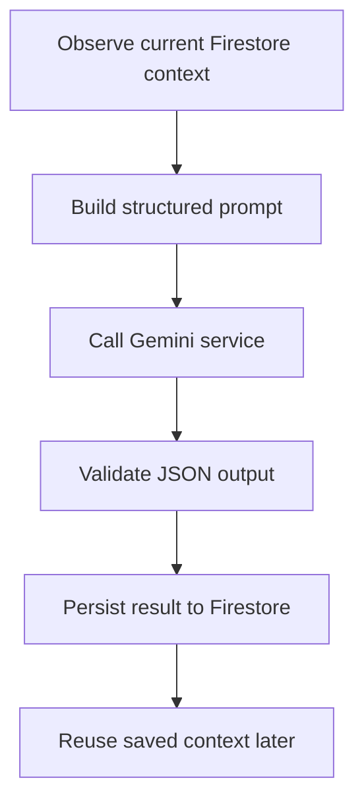

# SCDF and Dell

This is a React + Vite application for SCDF fitness tracking, training guidance, commander oversight, and admin management. It has three main surfaces: the personnel experience, the commander experience, and the admin console.

## Table of Contents

1. [App overview](#app-overview)
2. [Fitbit and Google Health sync](#fitbit-and-google-health-sync)
3. [User surfaces](#user-surfaces)
4. [Commander interface](#commander-interface)
5. [Admin interface](#admin-interface)
6. [Agentic AI](#agentic-ai)
7. [Training plan generator](#training-plan-generator)
8. [AI Coach](#ai-coach)
9. [Repository layout](#repository-layout)
10. [Setup](#setup)
11. [Required software](#required-software)
12. [VS Code extensions](#vs-code-extensions)
13. [Repository recovery](#repository-recovery)
14. [Firebase recovery](#firebase-recovery)
15. [How MCP fits in](#how-mcp-fits-in)
16. [Sources and documentation](#sources-and-documentation)
17. [Quick recovery checklist](#quick-recovery-checklist)

## App overview

- Stores personnel, commander, IPPT, health, meal, and training data in Firestore
- Uses health context such as heart rate, sleep, running distance, and run time to adapt recommendations when available
- Generates weekly training plans from Firestore history using a Gemini-powered service
- Saves each generated plan with a timestamp so users can revisit earlier plans
- Persists AI Coach chat history per user so conversations survive refreshes and return visits
- Provides commander-facing views for section readiness, personnel review, and commander training briefs
- Provides admin views for user management and official IPPT result maintenance
- Uses a route-aware bottom navigation bar for the personnel and commander experiences

## Fitbit and Google Health sync

The app keeps exercise and health statistics in sync through the Home page and a small Google Health connection flow.

1. On the Home page, the user can connect a health account through the `useFitbitApi` hook.
2. The hook starts a Google OAuth flow, exchanges the returned authorization code through the backend, and stores the resulting access token locally for the signed-in user.
3. When the account is connected, the app reads daily health data such as steps, heart rate, calories, distance, running distance, run time, average exercise heart rate, and sleep.
4. The values are fetched from Google Health APIs and mirrored into Firestore under `healthData`, where the rest of the app can reuse them.
5. If the user is offline, disconnected, or not fully synced yet, the app can still fall back to the most recent saved values from Firestore.
6. The Training page and AI Coach read those saved health values to adjust workout intensity, stamina advice, and recovery guidance.

This means users can keep track of exercise and health statistics in one place without needing to manually re-enter the same numbers everywhere. The code in this repo uses Google Health sync and Fitbit-style health fields, but it does not hide any extra device integration beyond the OAuth, token exchange, and Firestore storage flow shown in the source.

## User surfaces

The personnel experience is split across several routes:

- `/` - [Home](src/pages/Home.jsx), the main landing page for logged-in personnel
- `/dashboard` - [Dashboard](src/pages/Dashboard.jsx), the summary view for practice IPPT, official results, and AI guidance
- `/training` - [Training](src/pages/Training.jsx), the training-plan generator and saved-plan browser
- `/ai-coach` - [AICoach](src/pages/AICoach.jsx), the conversational coaching assistant
- `/RunTracker` - [RunTracker](src/pages/RunTracker.jsx), the run-tracking flow
- `/unit-readiness` - [UnitReadiness](src/pages/UnitReadiness.jsx), the readiness view for personnel
- `/profile` - [Profile](src/pages/Profile.jsx), the user profile page
- `/login` and `/logout` - authentication entry and sign-out routes

## Commander interface

Commander users are routed to a separate set of views:

- `/commander-home` - [CommanderHome](src/pages/CommanderHome.jsx), the section overview and readiness summary
- `/section` - [Section](src/pages/Section.jsx), the section-level personnel view
- `/commander-training` - [CommanderTraining](src/pages/CommanderTraining.jsx), the commander training brief and action workflow

The commander bottom navigation is implemented in [src/components/CommanderNav.jsx](src/components/CommanderNav.jsx).

## Admin interface

The admin surface is separated from the personnel and commander flows:

- `/admin-login` - [AdminLogin](src/pages/AdminLogin.jsx), the admin sign-in page
- `/admin` - [Admin](src/pages/Admin.jsx), the management console for users, commanders, and Firestore-backed records
- `/ippt-results` - [IPPTResults](src/pages/IPPTResults.jsx), the official IPPT results view

## Agentic AI

"Agentic AI" sounds technical, but in this app it simply means the app does a small loop of work for the user instead of giving one fixed answer.

The app does not let the model roam freely or perform hidden actions. Instead, the page collects the facts it already knows, sends those facts to Gemini with a very specific instruction, checks the answer, and saves the result so it can be used later.

Think of it like a careful assistant:

- First it looks at the available records
- Then it asks Gemini to work only from those records
- Then it checks that the reply is valid JSON
- Then it stores the result back in Firestore for later use



In practice, the loop is:

1. Observe: the UI gathers the current profile, IPPT data, health context, saved plans, and chat history before calling the model.
2. Reason: each feature builds a strict prompt that tells Gemini what evidence to use and what structure to return.
3. Act: the Gemini service sends the prompt through its model cascade and handles retries and fallback paths.
4. Verify: responses are checked as JSON before they are accepted by the UI.
5. Persist: accepted results are written back to Firestore so they can be reused later.

## Training plan generator

The Training page is the user-facing plan generator.

1. The page loads the current user, previous training history, and the latest Firestore evidence.
2. The user can choose a saved plan from the paginated dropdown or generate a new one.
3. The Gemini service produces a structured JSON recommendation based on the provided context.
4. The saved result is written back to Firestore with a generation timestamp.
5. Older plans stay accessible in pages of five so the list remains usable on a small screen.

In plain language, the page acts like a careful assistant rather than a random generator. For example, if the latest health snapshot shows low sleep and an elevated heart rate, the page tells Gemini to keep the next plan lighter, reduce volume, and focus more on recovery. If the user has stronger endurance data, it can keep or slightly increase stamina work, but it still stays within the constraints of the stored Firestore context.

The generated plan UI is intentionally compact:

- Summary text is shown first
- Weak areas are listed separately
- The weekly plan is broken into collapsible day rows
- Exercise details are kept concise with sets, reps, muscle groups, and form cues
- A floating scroll button appears only while the user is actively scrolling

## AI Coach

AI Coach is the conversational surface for short fitness questions and plan adjustments.

1. The page loads the current user profile, training context, and latest saved recommendation.
2. The user can expand a context section when they want more background, but the chat stays the main focus.
3. The user asks for a quick adjustment, recovery tip, or extra exercise idea.
4. Gemini answers using the same Firestore-backed evidence that powers the Training page.
5. Chat history is saved per user and restored when the user returns.
6. Suggested prompts are shown in the conversation and collapse after use so the page stays tidy.

In plain language, AI Coach takes the same facts as the Training page but turns them into a short conversation. For example, if a user asks, "What can I do for a stronger core?" the app sends that question together with the current profile, the latest saved plan, health context, and recent chat history. Gemini then gives a short answer, may ask follow-up questions when the request is vague, and can suggest a few tap-to-use prompts so the user does not need to start from scratch.

## Repository layout

- [src/pages/Home.jsx](src/pages/Home.jsx) - personnel landing page
- [src/pages/Dashboard.jsx](src/pages/Dashboard.jsx) - personnel dashboard for practice IPPT, official IPPT, and AI summary
- [src/pages/Training.jsx](src/pages/Training.jsx) - training-plan generation UI and saved plan browser
- [src/pages/AICoach.jsx](src/pages/AICoach.jsx) - conversational coaching assistant
- [src/pages/RunTracker.jsx](src/pages/RunTracker.jsx) - run tracking flow
- [src/pages/UnitReadiness.jsx](src/pages/UnitReadiness.jsx) - personnel readiness view
- [src/pages/Profile.jsx](src/pages/Profile.jsx) - user profile page
- [src/pages/CommanderHome.jsx](src/pages/CommanderHome.jsx) - commander overview and readiness summary
- [src/pages/Section.jsx](src/pages/Section.jsx) - commander section view
- [src/pages/CommanderTraining.jsx](src/pages/CommanderTraining.jsx) - commander training brief and action workflow
- [src/pages/AdminLogin.jsx](src/pages/AdminLogin.jsx) - admin login page
- [src/pages/Admin.jsx](src/pages/Admin.jsx) - admin console
- [src/pages/IPPTResults.jsx](src/pages/IPPTResults.jsx) - official IPPT results page
- [src/components/BottomNav.jsx](src/components/BottomNav.jsx) - personnel bottom navigation
- [src/components/CommanderNav.jsx](src/components/CommanderNav.jsx) - commander bottom navigation
- [src/components/ProtectedRoute.jsx](src/components/ProtectedRoute.jsx) - role-based route guard
- [src/services/firestoreService.js](src/services/firestoreService.js) - Firestore read/write helpers and context loaders
- [src/services/geminiService.js](src/services/geminiService.js) - Gemini API integration and response handling
- [src/services/ipptCalculator.js](src/services/ipptCalculator.js) - IPPT scoring helper
- [src/firebase.js](src/firebase.js) - Firebase app initialization and Firestore export

## Setup

1. Install dependencies with `npm install`.
2. Create `.env.local` in the project root.
3. Add `VITE_GEMINI_API_KEY=your_api_key_here`.
4. Start the app with `npm run dev`.

## Required software

Install these on a new Windows machine:

- Visual Studio Code
- Node.js LTS
- Git
- Firebase CLI

Recommended installer commands:

```powershell
winget install Microsoft.VisualStudioCode
winget install OpenJS.NodeJS.LTS
winget install Git.Git
```

Install Firebase CLI with npm:

```powershell
npm install -g firebase-tools
```

Verify the tools:

```powershell
node -v
npm -v
git --version
firebase --version
code --version
```

If `code` is not available, open VS Code and run `Ctrl+Shift+P`, then `Shell Command: Install 'code' command in PATH`.

## VS Code extensions

### Recommended minimum set

```vscode-extensions
github.copilot-chat,google.geminicodeassist,damphat.firebase-json,sonarsource.sonarlint-vscode,semanticworkbenchteam.mcp-server-vscode
```

Use these for chat-based coding assistance, Gemini support, Firebase config validation, code quality, and MCP-oriented tooling.

### Optional but useful

```vscode-extensions
saoudrizwan.claude-dev,zebradev.mcp-server-runner,googlecloudtools.firebase-dataconnect-vscode
```

### Command-line extension install

```powershell
code --install-extension github.copilot-chat
code --install-extension google.geminicodeassist
code --install-extension damphat.firebase-json
code --install-extension sonarsource.sonarlint-vscode
code --install-extension semanticworkbenchteam.mcp-server-vscode
```

## Repository recovery

If the project folder is lost, restore these files first:

- `package.json`
- `firebase.json`
- `firestore.rules`
- `firestore.indexes.json`
- `src/firebase.js`
- `src/services/firestoreService.js`
- `src/services/geminiService.js`
- `src/pages/Home.jsx`
- `src/pages/Dashboard.jsx`
- `src/pages/Training.jsx`
- `src/pages/AICoach.jsx`
- `src/pages/CommanderHome.jsx`
- `src/pages/CommanderTraining.jsx`
- `src/pages/Admin.jsx`
- `.env.local` value, stored securely outside git if it contains real secrets

Then run `npm install`, recreate `.env.local` with `VITE_GEMINI_API_KEY=your_api_key_here`, start the app with `npm run dev`, and validate with `npm run build`.

## Firebase recovery

The app uses Firestore as the source of truth for user, training, and admin data.

Expected top-level collections used by the current code:

- `users`
- `officialIPPT`
- `ipptRecords`
- `smartHealth`
- `healthData`
- `mealPlans`
- `trainingPlans`
- `trainingBenchmarks`
- `aiCoachChats`
- `aiCoachRecommendations`
- `teamReadiness`
- `teamStatistics`

Important behavior:

- AI plans are stored per user.
- Each recommendation has a `generatedAt` timestamp.
- The Training page starts with no plan selected.
- AI Coach conversations are stored per user in `aiCoachChats` and restored when the page loads.
- The Training page only shows five saved plans at a time in the dropdown.
- Users can page through older plans in groups of five.
- Long plans are intentionally collapsed into sections.
- A floating scroll button appears only while scrolling.
- Each day row shows a chevron so users can tell exercise details are expandable.
- Commander views use official IPPT history to build section readiness and brief summaries.
- Admin views read and update user and official IPPT records directly from Firestore.

## How MCP fits in

The current app does not require MCP to run.

MCP becomes useful if you want an AI coding assistant to inspect files, read Firestore context through a tool, generate plans through a tool, save plans through a tool, or run validation commands through a tool.

## Sources and documentation

- [Model Context Protocol documentation](https://modelcontextprotocol.io/docs)
- [Gemini API docs](https://ai.google.dev/gemini-api/docs)
- [Gemini API pricing](https://ai.google.dev/pricing)
- [Gemini API reference](https://ai.google.dev/api/generate-content)
- [AI Studio API key page](https://aistudio.google.com/app/apikey)

## Quick recovery checklist

1. Restore the repository files listed above.
2. Run `npm install`.
3. Add `VITE_GEMINI_API_KEY` to `.env.local`.
4. Start the app with `npm run dev`.
5. Validate with `npm run build`.
